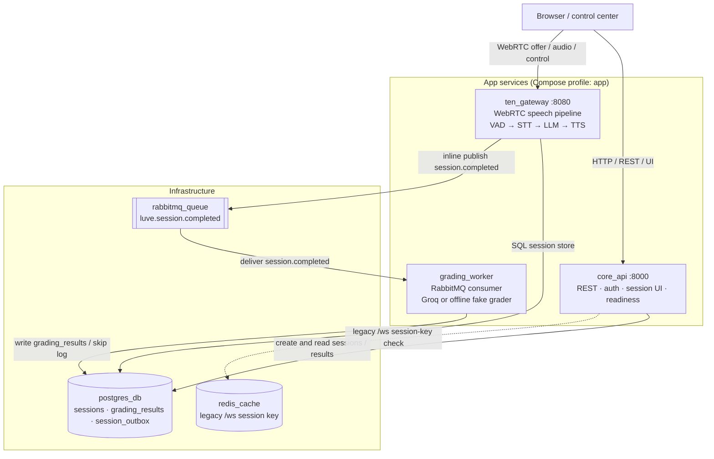
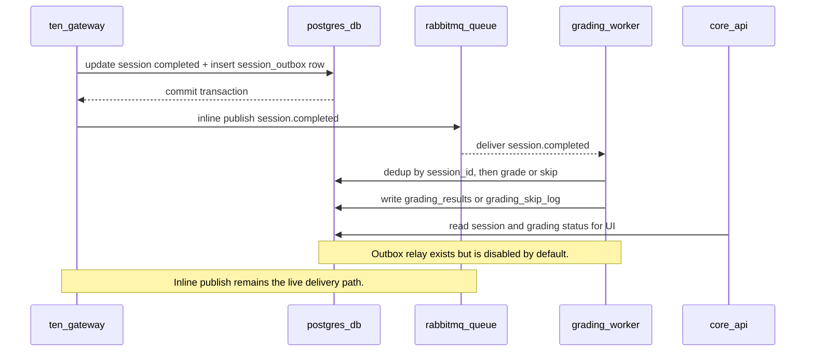

# LUVE

**LUVE** is an open-source backend for **real-time English speaking practice**. A
browser "control center" streams microphone audio over WebRTC to a realtime
pipeline (VAD → speech-to-text → LLM reply → text-to-speech), and after a session
ends the conversation is scored asynchronously by an LLM grader.

It is a Docker Compose monorepo of independent services that communicate over HTTP
and RabbitMQ — they never import each other's code.

## Status

**Local / dev / demo-ready — not production-ready.** It runs end-to-end on a
single machine for demos and development. Production deployment still needs:
TLS / reverse proxy, secrets management, CI/CD, a production migration workflow,
observability/metrics, and deployment hardening.

Two honesty notes about reliability:

- **Realtime STT** is validated only in a constrained demo config (forced English,
  `small.en`); multilingual / auto-language modes exist but are not validated.
- **Session completion delivery records durable recovery state, not
  exactly-once delivery.** When a session ends, the gateway commits session state
  *and* a `session_outbox` row in one transaction, then publishes
  `session.completed` inline. That inline publish is the current live RabbitMQ
  path. The transactional **outbox relay** (in `grading_worker`) is **disabled by
  default** (`OUTBOX_RELAY_ENABLED=false`); when deliberately enabled, it drains
  pending outbox rows for durable, at-least-once recovery on the publish side.
  It can republish after a crash between broker confirm and the DB mark, so
  grading is idempotent (deduped on `session_id`) and duplicate
  `session.completed` messages do not double-grade.

## Architecture

A browser session talks to two app services: `core_api` for REST/auth/session UI
and `ten_gateway` for realtime WebRTC audio/control. PostgreSQL is the source of
truth for sessions, grading results, skip logs, and outbox rows. RabbitMQ carries
the live `session.completed` grading job. Redis is auxiliary to the legacy
`/ws/chat/{session_id}` session-key check, not the current TEN/WebRTC transcript
store.

### Service topology



### Session completion and grading flow



`rabbitmq_init` is a one-shot service that declares the dead-letter topology
(`luve.session.completed.dlq`) so poison messages are retained. The outbox relay
is not shown as a live path because it is disabled by default; enabling it is a
separate operator decision, not the normal startup path. The relay is a recovery
mechanism for pending `session_outbox` rows, not an exactly-once delivery
guarantee.

## Services

| Service | Port | Role |
|---|---|---|
| `core_api` | 8000 | REST API, auth, control-center UI + static, readiness |
| `ten_gateway` | 8080 | WebRTC / TEN realtime pipeline (VAD→STT→LLM→TTS); reuses the `core_api` image |
| `grading_worker` | — | Consumes `session.completed` from RabbitMQ; grades via Groq (or an offline "fake" grader); writes `grading_results` |
| `postgres_db` | 5432 | PostgreSQL (sessions, grading results, outbox) |
| `redis_cache` | 6379 | Redis (legacy WebSocket session-key check; auxiliary to the TEN/WebRTC path) |
| `rabbitmq_queue` | 5672, 15672 | RabbitMQ broker + management UI |
| `rabbitmq_init` | — | One-shot: declares the grading dead-letter topology, then exits |

App services run under the Compose `app` profile.

## Quick start (CPU default)

These commands run **containers**, not manual `venv` processes.

```bash
# 1. Create the root .env (Compose reads this — see "Configuration" below)
cp .env.example .env   # then fill in real values locally

# 2. Start the full stack (first run needs --build so ten_gateway can reuse the
#    core_api image). Plain `docker compose up -d` (no profile) starts ONLY infra.
docker compose --profile app up -d --build

# Fast restart later (images already built):
docker compose --profile app up -d
```

CPU STT is the default demo mode and needs no GPU.

## Configuration

**Compose reads the root `.env`** (Compose variable interpolation). The
per-service `services/*/.env` files are only for running a service standalone
(advanced/debug); they are **not** used by Docker Compose. Real `.env` files are
git-ignored — only `.env.example` templates are tracked. Never commit secrets.

Core variables (see `.env.example`; names only — fill in locally):

```bash
# core_api + ten_gateway use SQLAlchemy async — note the +asyncpg driver:
DATABASE_URL=postgresql+asyncpg://<user>:<url-encoded-password>@postgres_db:5432/luve_database
# grading_worker uses raw asyncpg — plain postgresql:// scheme:
GRADING_DATABASE_URL=postgresql://<user>:<url-encoded-password>@postgres_db:5432/luve_database
SECRET_KEY=<random-secret>

POSTGRES_USER=dat_admin
POSTGRES_PASSWORD=<password>
POSTGRES_DB=luve_database
RABBITMQ_USER=<user>
RABBITMQ_PASS=<password>

# STT mode (gateway). Defaults: forced English, small.en, second pass off.
STT_LANGUAGE_MODE=forced_en
STT_MODEL_SIZE=small.en
STT_ENABLE_SECOND_PASS_VERIFICATION=false
```

URL-encode reserved characters (`@ / : %`) in passwords.

**Grading provider** — defaults to the offline `fake` dev grader (no external
calls). For real Groq grading, set these in the root `.env`:

```bash
GRADING_PROVIDER=llm
LLM_PROVIDER=groq
GRADING_FAKE_FALLBACK=false
GROQCLOUD_API_KEY=<your-groq-key>
```

These keys have safe Compose defaults (`fake` grader, no external calls); add
them to the root `.env` only when overriding the default fake grader.

**Outbox relay** — disabled by default; Compose passes conservative defaults
(`OUTBOX_RELAY_ENABLED=false`, batch 5, poll 5s, publish timeout 5s, max attempts
5). Do **not** enable it without the preflight in `docs/ai/CLAUDE_CODE_HANDOFF.md`
§L5. The reliability model remains at-least-once retry when the relay is enabled,
not exactly-once delivery; inline publish stays the live path until a monitored
cutover.

## Optional GPU STT (opt-in)

Runs `ten_gateway` STT on an NVIDIA GPU. It affects **`ten_gateway` only** —
`grading_worker`/Groq and every other service are unchanged. Requires the NVIDIA
Container Toolkit.

```bash
# Prerequisite check:
docker run --rm --gpus all nvidia/cuda:12.3.2-base-ubuntu22.04 nvidia-smi

# Start with the GPU override (builds luve-core-api:gpu with the CUDA libs
# ctranslate2/faster-whisper need):
docker compose -f docker-compose.yml -f docker-compose.gpu.yml --profile app up -d --build
```

Omit the override to return to the CPU default — no GPU required.

## Access & health

- Control center UI: `http://localhost:8000/control-center`
- Core API: `http://localhost:8000`
- RabbitMQ management: `http://localhost:15672` (credentials from your `.env`)

```bash
curl http://localhost:8000/readyz     # core_api: 200 iff DB reachable
curl http://localhost:8080/readyz     # ten_gateway: shallow startup readiness
curl http://localhost:8080/rtc/health # ten_gateway: realtime session snapshot
```

## Development & tests

Each service has its own `pytest` suite, run inside that service's virtualenv —
for example:

```bash
cd services/core-api
venv/bin/python -m pytest tests/ -q
```

Prefer **focused** runs (target specific test files) during iteration. A full
`tests/` run has intermittently hung in some environments, so the full suite is
**not** asserted green here — run the subset relevant to your change.

## Operations

```bash
docker compose ps
docker compose logs -f ten_gateway     # realtime pipeline
docker compose logs -f grading_worker  # async grading (look for worker.ready, grading.completed)

docker compose --profile app down      # stop the stack
```

⚠️ Do **not** add `-v` to `down` unless you intend to delete volumes — `down -v`
wipes the Postgres data and the cached STT model.

Notes:
- Grading is **asynchronous**; results land in `grading_results` after the worker
  finishes (verify via `psql` inside `postgres_db`).
- The **outbox relay stays default-off**; inline publish is the live delivery path.
- Manual `venv` runs (`uvicorn src.main:app`, `python run_ten.py`, the worker) are
  for debugging a single service — **do not** run them while the Compose stack is
  up (they conflict on ports 8000/8080 and the RabbitMQ queue).

## Repository layout

```
luve/
├── docker-compose.yml          # default CPU stack (app profile)
├── docker-compose.gpu.yml      # opt-in GPU override (ten_gateway)
├── .env.example                # root template (Compose reads root .env)
├── services/
│   ├── core-api/               # core_api image (also runs ten_gateway via run_ten.py)
│   └── grading-worker/         # async grading consumer (Groq / offline fake)
├── infrastructure/
│   ├── db-init/                # 01-init.sql (fresh-volume baseline schema)
│   ├── db-migrations/          # numbered SQL migrations (0001–0003)
│   └── rabbitmq/               # one-shot dead-letter (DLQ) topology setup
└── docs/                       # architecture + AI/ops handoff docs
```

**Rule — no cross-importing:** `core-api` and `grading-worker` never import each
other's code; they communicate only over HTTP and RabbitMQ.

## Known limitations

- **Delivery recovery is not automatic by default** — inline publish is the live
  path; the default-off outbox relay can provide at-least-once retry when enabled,
  while idempotent grading handles duplicate `session.completed` messages.
- **Grading is asynchronous** — the Session Analysis panel may need a refresh/poll
  before the result appears.
- **Pronunciation** may be unavailable when a session has insufficient clear-audio
  evidence.
- **CPU STT** (default) has higher latency than GPU STT; **GPU STT** requires the
  NVIDIA Container Toolkit.
- One active realtime session per node (gateway capacity is 1 by design).
- Not production-ready (see **Status**).

## License

MIT — see [`LICENSE`](./LICENSE).
