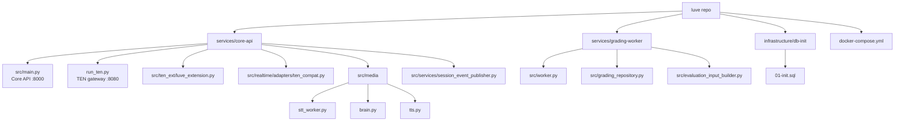
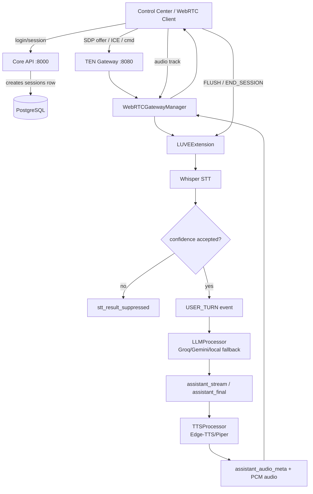
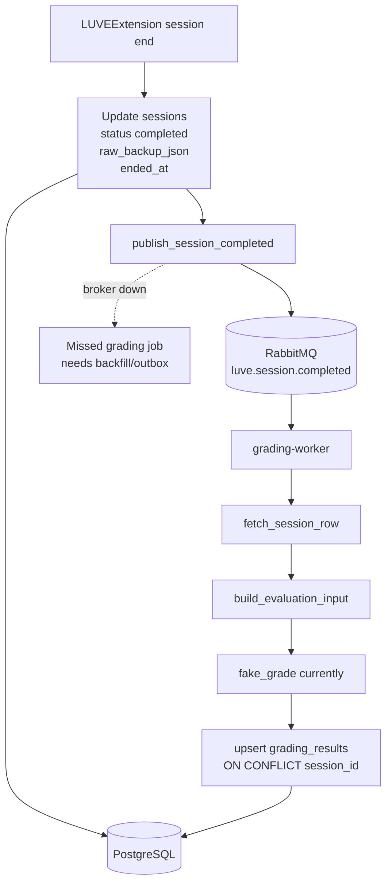

# Claude Code Handoff: LUVE

> [!IMPORTANT]
> **For current mutable state, read [PROJECT_STATE.md](PROJECT_STATE.md) and [NEXT_TASK.md](NEXT_TASK.md) first.**
>
> This file is a historical architecture handoff. It is useful for service/module orientation, but it is not the current mutable state source of truth.

This document is a factual onboarding handoff for Claude Code. It is not a product spec and does not replace the running code as source of truth.

## A. Project Purpose

LUVE is an AI-assisted English speaking practice system. The current implemented center of gravity is a Python/FastAPI Core API plus a separate TEN/WebRTC gateway for realtime voice sessions.

Current practical goal:

- Let a user create an authenticated session.
- Connect a WebRTC client to the TEN gateway.
- Stream microphone audio through STT.
- Optionally produce LLM and TTS responses.
- Persist a realtime session event log into PostgreSQL.
- Publish `session.completed` so a grading worker can produce a grading result.

Do not assume the wider product vision is fully implemented.

## B. Current Repository Status

The repo is a monorepo, but implementation depth is uneven.

- `services/core-api/` contains the main backend runtime and realtime code.
- `services/grading-worker/` contains a lightweight worker implementation, fake grader, and grading input builder.
- `docker-compose.yml` runs only infrastructure: PostgreSQL, Redis, RabbitMQ.
- Core API and TEN gateway are still run manually in local development.
- `clients/mobile-app/` and `services/media-server/` should not be assumed complete.

Historical HEAD at original handoff time:

```text
795fafe fix(core-api): reuse RabbitMQ session event publisher
0c09f5b test(core-api): improve stress harness cooldown checks
bddfa10 test(core-api): add realtime WebRTC stress harness
ff5d316 chore(core-api): add TEN runtime health diagnostics
71dad36 fix(core-api): harden control-center realtime lifecycle
d6d8278 fix(core-api): stabilize outbound WebRTC audio cleanup
d235b64 fix(core-api): prioritize final STT in TEN runtime
567b00e fix(core-api): refine LLM runtime behavior
fac6830 feat(core-api): reject unreliable STT finals
```

## C. Service And Folder Map

- `services/core-api/src/main.py`: FastAPI Core API on port `8000`.
- `services/core-api/run_ten.py`: TEN/WebRTC gateway on port `8080`.
- `services/core-api/src/ten_ext/luve_extension.py`: realtime orchestration for STT, LLM, TTS, session end, and event persistence.
- `services/core-api/src/realtime/adapters/ten_compat.py`: aiortc/TEN compatibility bridge and WebRTC session manager.
- `services/core-api/src/media/stt_worker.py`: faster-whisper singleton, CUDA health, CPU fallback, STT metadata mapping.
- `services/core-api/src/media/brain.py`: LLM provider runtime for Groq, Gemini, and local fallback.
- `services/core-api/src/media/tts.py`: Edge-TTS/Piper TTS runtime and PCM chunking.
- `services/core-api/src/services/session_event_publisher.py`: RabbitMQ `session.completed` publisher.
- `services/core-api/scripts/realtime_stress.py`: local/dev realtime stress harness.
- `services/grading-worker/src/worker.py`: RabbitMQ consumer for `session.completed`.
- `services/grading-worker/src/grading_repository.py`: session fetch and grading result upsert.
- `services/grading-worker/src/evaluation_input_builder.py`: pure conversion from persisted raw session events to grading input.
- `infrastructure/db-init/01-init.sql`: PostgreSQL schema.

## D. Realtime Voice Pipeline

Primary manual runtime:

1. Start Core API:

   ```bash
   cd services/core-api
   source venv/bin/activate
   uvicorn src.main:app --host 0.0.0.0 --port 8000
   ```

2. Start TEN gateway:

   ```bash
   cd services/core-api
   source venv/bin/activate
   python run_ten.py
   ```

3. Use control center at:

   ```text
   http://127.0.0.1:8080/control-center
   ```

Runtime flow:

- `POST /api/v1/auth/login` gets a token.
- `POST /api/v1/sessions` creates a DB session with `status='ready'`.
- `POST /rtc/offer` on TEN gateway creates a WebRTC session.
- Browser or stress harness sends audio track and datachannel commands.
- `LUVEExtension` ingests PCM, runs partial/final STT, filters unreliable finals, and either suppresses or sends accepted text to LLM.
- LLM response may produce text events and TTS audio chunks.
- Mute Mic in control center sends `FLUSH` to finalize current utterance.
- Disconnect closes WebRTC and sends `END_SESSION`.

Important current behavior:

- Final STT is prioritized over partial STT to avoid CUDA backlog.
- Partial STT is intentionally less aggressive to protect final latency.
- Rejected STT finals should not become `USER_TURN`, should not call LLM, and should not trigger TTS.
- WebRTC outbound audio emits continuous silence while a peer session is active to keep Chrome audio playout stable.
- Continuous silence has CPU cost while a session is active, so cleanup must remain strict.

## E. Session Completion And Grading Pipeline

Session completion:

- `LUVEExtension._persist_event_log()` updates `sessions` with `status='completed'`, `ended_at`, and `raw_backup_json` on session completion.
- Empty event logs are now persisted as `[]`, not `NULL`.
- After DB commit, it calls `publish_session_completed(session_id)`.
- `session_event_publisher.py` publishes:

  ```json
  {
    "event_type": "session.completed",
    "schema_version": "v1",
    "session_id": "<SESSION_ID>",
    "created_at": "<ISO_TIMESTAMP>"
  }
  ```

RabbitMQ publishing:

- Current publisher uses lazy `aio_pika.connect_robust`.
- Connection and channel are cached and reused.
- Queue declaration is reused per channel.
- Publish remains best-effort with `PUBLISH_TIMEOUT_SECONDS = 2.0`.
- Failure logs and returns `False`; it does not block session cleanup beyond timeout.
- `close_publisher()` exists but is not wired into shutdown yet.

Grading worker:

- Consumes queue `luve.session.completed`.
- Fetches session row by `session_id`.
- Builds grading input from `raw_backup_json`.
- Uses `fake_grade()` currently.
- Upserts into `grading_results` by `session_id`.
- `grading_results.session_id` is unique in schema.

Known delivery gap:

- The durable outbox exists but its relay is default-off (§L5); inline publish is still the live path, so with the relay disabled a completed session can miss grading if RabbitMQ is down at publish time until the relay is enabled or recovery tooling/backfill runs.
- If RabbitMQ is down at publish time, a completed session can miss grading until recovery tooling runs.
- Recovery tooling now exists via a manual backfill script and a one-shot reconciliation scanner, but neither is a transactional outbox.
- Historical DB audit showed many completed sessions missing `grading_results`; many were test/stress sessions, so recovery tooling must filter carefully.

## F. Infrastructure Roles

### PostgreSQL

- Stores `users`, `lessons`, `sessions`, and `grading_results`.
- `sessions.raw_backup_json` stores persisted realtime event logs.
- `grading_results.session_id` has a unique constraint and supports idempotent worker upsert.

### RabbitMQ

- Queue name: `luve.session.completed`.
- Used for session completion notification from Core API/TEN runtime to grading worker.
- Local compose service: `rabbitmq_queue`.
- Exposes `5672` and management UI on `15672`.

### Redis

- Used by legacy WebSocket stream paths and session validation logic.
- Local compose service: `redis_cache`.
- Do not assume every realtime TEN path depends on Redis.

### CUDA/GPU

- STT uses faster-whisper with CUDA when available.
- `stt_worker.py` performs CUDA health checks and can fall back to CPU.
- Previous CUDA failures were real; CPU fallback is intentionally retained.
- GPU health must be verified before blaming realtime pipeline logic.

## G. Recent Reliability Commits

- `fac6830 feat(core-api): reject unreliable STT finals`
  - Captures segment-level STT confidence metadata.
  - Suppresses low-confidence/no-speech finals before user turn, LLM, and TTS.
  - Adds controlled CUDA fallback path.

- `567b00e fix(core-api): refine LLM runtime behavior`
  - Refines LLM runtime behavior in `brain.py`.

- `d235b64 fix(core-api): prioritize final STT in TEN runtime`
  - Drops/skips partial STT when final is pending or inference is busy.
  - Restores LLM exception handling and `llm_error` emission.

- `d6d8278 fix(core-api): stabilize outbound WebRTC audio cleanup`
  - Adds continuous silence frames for Chrome playout stability.
  - Makes outbound audio track close safer.

- `71dad36 fix(core-api): harden control-center realtime lifecycle`
  - Mute Mic sends `FLUSH`.
  - Adds stale ICE guard and page unload cleanup.
  - Gates heavy diagnostics off by default.

- `ff5d316 chore(core-api): add TEN runtime health diagnostics`
  - Adds `GET /rtc/health`.
  - Exposes active sessions, queued frames, and close summaries.
  - Adds low-noise STT/LLM/TTS timing logs.

- `bddfa10 test(core-api): add realtime WebRTC stress harness`
  - Adds `scripts/realtime_stress.py`.
  - Uses aiortc/httpx to create sessions, connect WebRTC, send audio, FLUSH, and verify cleanup.

- `0c09f5b test(core-api): improve stress harness cooldown checks`
  - Adds cooldown snapshots before judging idle CPU.

- `795fafe fix(core-api): reuse RabbitMQ session event publisher`
  - Adds lazy robust RabbitMQ publisher with cached connection/channel.
  - Preserves best-effort timeout behavior.

## H. Current Reliability Evidence

Verified in local/dev environment:

- `noise` STT-only no TTS: `10/10` pass.
- `short_english` LLM no TTS: `10/10` pass.
- `short_english` LLM+TTS: `5/5` pass.
- TTS long-drain: `5/5` pass after cooldown.
- `active_sessions_after_cooldown=0`.
- `run_ten_cpu_after_cooldown=9.6` in the noted long-drain verification.
- RabbitMQ UP test: real session completion published successfully.
- RabbitMQ DOWN test: session cleanup completed and health stayed OK; publish failed best-effort.
- RabbitMQ RECOVERY test: subsequent real session published successfully after broker restart.

Do not generalize this as production readiness. It proves the current local baseline is materially more stable than before.

## I. Known Limitations

- Not production-ready.
- Durable outbox exists but its relay is default-off (§L5); missed grading jobs rely on the relay when enabled, recovery tooling, or manual backfill.
- `close_publisher()` is not wired into shutdown; TEN shutdown may log a robust connection reconnect warning.
- Word-level confidence should move to offline/post-session analysis. Realtime word-level confidence can increase latency.
- Non-English/background speech turn-boundary finalization is future work.
- Occasional `401` before successful `201` can happen in control-center token/session flow.
- VAD redesign is risky and can easily harm latency/UX.
- Whisper warm singleton/prewarm strategy is not fully solved as a production scaling feature.
- Grading worker currently uses fake grader, not final pedagogical grading.
- Worker poison messages (invalid/validation) are dead-lettered to `luve.session.completed.dlq` by the T5b dead-letter policy rather than dropped; transient failures retry then record a terminal `failed` state (T5a/T5b). A durable publish-side outbox is still future work (T7).
- Stress harness creates real DB sessions and can publish real `session.completed` events in dev.
- Readiness vs liveness (T4a): `core_api GET /readyz` checks DB reachability via `SELECT 1` (200/503, no DSN leak); `ten_gateway GET /readyz` is **shallow startup readiness only** (gateway/extension initialized) and intentionally does NOT ping DB/Groq/STT/WebRTC hot path. Therefore gateway `/readyz` can return 200 while DB-dependent `/rtc/offer` and session-ownership checks through `SQLSessionStore` would fail if the DB is down. DB health is surfaced by `core_api /readyz`, not the gateway probe.
- Compose healthchecks remain **liveness** checks (API `/`, gateway `/healthz`) and are intentionally separate from `/readyz`. Orchestrators may consume `/readyz` for readiness gating, but gating Compose healthchecks on `/readyz` is a future explicit task, not done here.

## J. Next Recommended Task

Read [NEXT_TASK.md](NEXT_TASK.md) for the current approved task scope.

Historical note:

- The original recommendation here was to audit grading delivery reliability and add a dry-run-first backfill path.
- That work has since moved forward: manual backfill and reconciliation scanner tooling now exist.
- The durable outbox + relay have since been built (T7, default-off — §L5); the remaining gap is making the relay the default path and retiring inline publish after a sustained monitored enable.

## K. Files Claude Must Not Touch Without Explicit Permission

- `services/core-api/src/media/stt_worker.py`
- `services/core-api/src/media/tts.py`
- `services/core-api/src/media/brain.py`
- `services/core-api/src/ten_ext/luve_extension.py`
- `services/core-api/src/realtime/adapters/ten_compat.py`
- `services/core-api/src/static/index.html`
- `services/core-api/run_ten.py`
- `infrastructure/db-init/01-init.sql`
- `.env`, `.env.*`, `login.json`, audio fixtures, or any secret/local payload file

These files affect realtime latency, credentials, data persistence, or browser lifecycle. Touch them only when the task explicitly authorizes it.

## L. Verification Commands

Basic status:

```bash
git status --short
git log --oneline -n 10
```

Infrastructure:

```bash
docker compose ps
ss -ltnp | grep -E ':8000|:8080|:5432|:5672|:6379|:15672' || true
```

Core API:

```bash
cd services/core-api
./venv/bin/python -m py_compile src/main.py run_ten.py
./venv/bin/python -c "from src.main import app; print(app.title)"
./venv/bin/python -c "import run_ten; print(run_ten.app.title)"
```

Realtime stress:

```bash
cd services/core-api
./venv/bin/python scripts/realtime_stress.py --loops 2 --mode rapid_disconnect --tts-enabled false --stt-only true --fail-fast false --cooldown-seconds 5
./venv/bin/python scripts/realtime_stress.py --loops 5 --mode short_english --tts-enabled true --stt-only false --disconnect-after-seconds 15 --fail-fast false
```

GPU:

```bash
nvidia-smi
cd services/core-api
./venv/bin/python - <<'PY'
import ctranslate2
import torch
print("ctranslate2_cuda_device_count", ctranslate2.get_cuda_device_count())
print("torch_cuda_available", torch.cuda.is_available())
print("torch_cuda_device_count", torch.cuda.device_count())
if torch.cuda.is_available():
    print("torch_cuda_name", torch.cuda.get_device_name(0))
PY
```

RabbitMQ connection count:

```bash
docker exec luve_rabbitmq rabbitmqctl list_connections name state channels
```

Do not print credentials or tokens when running diagnostics.

## L2. Observability / Metrics Surfaces

Useful telemetry already exists; T4b is documentation-only (no new code or dependencies).

- **Gateway sessions** — `GET /rtc/health` (ten_gateway :8080) returns a runtime snapshot: `active_sessions`, `closed_sessions_total`, `max_session_age_seconds`, plus per-session connection/ICE state, `queued_frames`, data channels, and tasks.
- **Readiness / liveness** — `core_api GET /readyz` = DB readiness (`SELECT 1`); `ten_gateway GET /readyz` = shallow startup readiness only. Compose healthchecks stay liveness-oriented (API `/`, gateway `/healthz`) and are intentionally separate from `/readyz`.
- **RabbitMQ** — the management API on `:15672` exposes queue/DLQ depth, consumers, and message rates; the `rabbitmq_prometheus` plugin exposes Prometheus-format broker metrics on `:15692` inside the image (compose does NOT publish 15692 by default). The dead-letter queue is `luve.session.completed.dlq`.

  ```bash
  # queue + DLQ depth (no app code needed)
  docker exec luve_rabbitmq rabbitmqctl list_queues name messages consumers | grep luve.session.completed
  ```
- **Grading worker outcomes** — the DB is the source of truth, not an app metric:

  ```sql
  SELECT status, count(*) FROM grading_results GROUP BY status;          -- graded / failed / processing
  SELECT skipped_reason, count(*) FROM grading_skip_log GROUP BY skipped_reason;
  ```
  Worker logs use greppable event names: `grading.completed`, `grading.job_requeued`, `grading.session_ineligible`, `grading.job_attempt_failed`, `worker.ready`.
- **Non-goals (current):** no `prometheus_client` dependency, no app `/metrics` endpoint, no worker HTTP metrics server. If metrics are added later, avoid high-cardinality labels such as `session_id`.
- **Future:** a small JSON `/metrics` (DB-derived counts) or a Prometheus integration can be added later only if scrape/ops requirements justify it.

## L3. STT Concurrency / Backpressure Model

How the realtime STT path bounds load today. This is descriptive (T9 is docs-only); the code described here is the current behaviour, not a change.

- **Admission — single session per node.** The gateway is hard-capped at one active TEN/WebRTC session: `effective_capacity = min(settings.max_webrtc_sessions, TEN_SINGLE_SESSION_CAPACITY=1)` in `realtime/adapters/ten_compat.py`. A second session is rejected with **HTTP 503 "WebRTC capacity reached on this node"** and its peer connection/track are closed; `ten_ext/luve_extension.py` also rejects start "because another session is active." Because concurrency is capped at 1, cross-session contention / multi-model GPU OOM are out of scope by design.
- **STT inference — offloaded and globally serialized.** `media/stt_worker.py` `WhisperInference` is a singleton; `transcribe_audio_bytes` runs the blocking faster-whisper call via `await asyncio.to_thread(...)` **inside a global `_inference_lock`**. Offloading keeps the asyncio event loop responsive (TTS, websocket sends, VAD continue); the lock serializes model access (the model is not safe for concurrent `transcribe`).
- **Per-session backpressure.** The live TEN path's `ten_ext/luve_extension.py` holds a bounded per-session `asyncio.Queue(maxsize=1)` drained by one `_inference_loop`. Drop/priority policy: when the queue is full a **partial is dropped**; a **final evicts the queued partial and is prioritized**. Memory is bounded per session; partials degrade first under load. (`media/coordinator.py` implements the same bounded-queue pattern but is a **separate realtime path**, not the live TEN queue.)
- **GPU / runtime behaviour.** Device is chosen by a health probe (`_probe_gpu_health`: `nvidia-smi`, ctranslate2 CUDA device count, torch) → CUDA else **CPU int8 fallback**. A CUDA/runtime failure mid-inference can degrade to CPU (gated by `stt_enable_cuda_fallback_to_cpu`); this **CPU fallback is sticky** — the singleton stays on CPU until process restart. Model load is lazy, guarded by `_model_lock`, and offloaded via `asyncio.to_thread`.
- **Observability.** `GET /rtc/health` exposes session/queue state (`active_sessions`, `queued_frames`, `max_session_age_seconds`); subtitle logs carry per-utterance timing (`inference_ms`, `coordination_ms`, `within_budget`). See §L2.
- **Final-utterance bound.** Final utterances are length-bounded: `stt_max_utterance_ms` (default 16000 ms) force-finalizes a turn via the `max_utterance` trigger in `ten_ext/luve_extension.py`, so a single final's audio (and thus its inference duration) is capped at ~16 s — there is no unbounded-monologue case.
- **Known limitations / non-goals (current):** no multi-session scheduler (single-session by design); **no per-inference timeout** (a hung `to_thread` transcription would hold `_inference_lock`; `asyncio.to_thread` is not cancellable, so `stop()` waits ≈ one inference); no GPU tests in CI. These residual improvements live in hot-path files (`ten_ext/luve_extension.py`, `media/stt_worker.py`) and should wait for a clean hot-path baseline before any code change.

## L4. Optional GPU STT (opt-in)

GPU STT for `ten_gateway` is **opt-in** and does not affect the default flow.

- **Default stays CPU, unchanged:** `docker compose --profile app up -d` uses `luve-core-api:local` (CPU). No GPU required anywhere; CPU STT fallback is intact.
- **GPU opt-in:** `docker compose -f docker-compose.yml -f docker-compose.gpu.yml --profile app up -d --build` builds `luve-core-api:gpu` from `services/core-api/Dockerfile.gpu` and grants `ten_gateway` `gpus: all`. **`ten_gateway` only** — `grading_worker`/Groq and other services are untouched. Requires the NVIDIA Container Toolkit.
- **Why a separate image:** the default `python:3.10-slim` base lacks `libcublas.so.12` (cuBLAS 12) and cuDNN 9 that `ctranslate2==4.7.1`/`faster-whisper` dynamically link for CUDA; the GPU image adds them via the `nvidia-cublas-cu12`/`nvidia-cudnn-cu12` wheels + `LD_LIBRARY_PATH`. The NVIDIA driver itself is injected at runtime by `gpus: all`.
- **Do NOT commit a personal `docker-compose.gpu.local.yml`** — it stays local/untracked; the tracked opt-in override is `docker-compose.gpu.yml`.

## L5. Outbox relay ops (T7)

The transactional outbox relay drains `session_outbox` → RabbitMQ, providing durable at-least-once recovery for pending rows in the publish-side dual-write gap (idempotent grading dedupes any duplicates) — it is **not** an exactly-once delivery guarantee. **It is default-OFF and not yet a normal runtime path.**

**Current state**
- Relay is **disabled by default**: `OUTBOX_RELAY_ENABLED=false` (compose passes `${OUTBOX_RELAY_ENABLED:-false}` to `grading_worker`). The passthrough exists but **does not enable** the relay on its own.
- **Inline `publish_session_completed` is still the live delivery path** — it runs after the completion commit and must stay until a later, separate atomic de-dup step.
- core-api writes the `session.completed` outbox row in the completion transaction (T7b); the worker has the relay loop + primitives (T7c-1/T7c-2), exercised only when the flag is true.

**Smoke evidence (all on throwaway services, fake grading, no Groq, no dev mutation)**
- One-shot relay: claim → publish → confirm → `published`; broker failure → `pending` → `failed` (bounded attempts), no row loss.
- Duplicate/idempotency: first → `grading.completed`; duplicate → `grading.already_graded`; `grading_results` count stays 1.
- Full-loop enable: `outbox_relay.ready` + `worker.ready`; `outbox_relay.drained published=2`; `grading.completed` for both synthetic sessions; queue depth drained to 0; duplicate transport → `already_graded`.

**Preflight (before enabling in any real/dev env)**
- Confirm `0003`/`session_outbox` schema is applied.
- Backlog: `SELECT status, count(*) FROM session_outbox GROUP BY status ORDER BY status;`
- Inspect failed rows:
  ```sql
  SELECT id, session_id, status, attempt_count, left(coalesce(last_error,''),120) AS last_error
  FROM session_outbox WHERE status='failed' ORDER BY updated_at DESC LIMIT 20;
  ```
- **Provider decision:** use `GRADING_PROVIDER=fake` for the first controlled dev enable, or **explicitly accept Groq cost** if `llm` (a backlog of ungraded rows would call Groq).
- Verify RabbitMQ queue/DLQ health; confirm no surprising pending backlog. **Do not enable** if the backlog is unexpected or the provider is unsafe.

**Recommended first-enable values** (bound lock time; safer than code defaults of batch 20 / timeout 10):
```
OUTBOX_RELAY_ENABLED=true
OUTBOX_RELAY_BATCH_SIZE=5
OUTBOX_RELAY_POLL_INTERVAL_SECONDS=5
OUTBOX_RELAY_PUBLISH_TIMEOUT_SECONDS=5
OUTBOX_RELAY_MAX_ATTEMPTS=5
```

**Enable** (only after preflight): set the values in the root `.env` (or a controlled shell override), then recreate **only** the worker:
```
docker compose --profile app up -d --no-deps --force-recreate grading_worker
```
Do **not** use `down -v`.

**Observe during enable**
- Logs: `outbox_relay.ready`, `outbox_relay.drained`; **no** `outbox_relay.cycle_failed` / `outbox_relay.publish_failed`.
- DB: `SELECT status, count(*) FROM session_outbox GROUP BY status ORDER BY status;` (pending→published, failed=0); per-row `published_at`/`last_error`.
- RabbitMQ queue depth (draining).
- Duplicate check: `SELECT session_id, count(*) FROM grading_results GROUP BY session_id HAVING count(*) > 1;` (expect **no rows**).

**Rollback**
- Set `OUTBOX_RELAY_ENABLED=false` (or unset) → recreate **only** `grading_worker`.
- **Preserve** `pending`/`failed` rows for diagnosis — never delete rows, never `down -v`.
- Inline publish stays active, so grading continues via the existing path.

**Hard stops:** failed rows climbing · queue depth growing/not draining · duplicate grading appears · provider would call Groq unintentionally · repeated `cycle_failed`/`publish_failed` · CPU/log hot-spin · a command targets the wrong stack · surprising pending backlog.

**Do NOT yet:** enable in committed defaults · remove inline publish · drain the dev backlog blindly · run with `GRADING_PROVIDER=llm` without accepting Groq cost · claim production readiness.

## L6. Google OAuth login (auth) — merged, disabled until configured

Google sign-in (server-side OIDC authorization-code flow) is **merged and public** but **OFF by default** — it activates only when Google credentials exist in the root `.env`. Same pattern as §L5: code shipped, enablement is a separate local operator step.

**Merged commits:** `1060078` backend foundation · `b9cc51c` schema-parity + conflict hardening · `0372e46` control-center "Continue with Google" + `google_code` exchange · `6289b07` ignore `.playwright-mcp/`.

**Done / verified (local dev):**
- Migration `0004` (`users.google_sub`, nullable `password_hash`, `chk_users_auth_method` CHECK, partial unique `users_google_sub_key`) applied + verified on the dev DB; `infrastructure/db-init/01-init.sql` has parity for fresh volumes. Pre-`0004` backup: `/tmp/luve_dev_backup_before_0004_20260604_122358.sql`.
- App rebuilt (`--build`); `core_api`/`ten_gateway`/`grading_worker` healthy.
- Password login/register still work. `GET /api/v1/auth/google/start` and `POST /api/v1/auth/google/exchange` return **404 "Google login is not available"** while disabled (no 500). The "Continue with Google" button renders; disabled-state click shows "Google login is not configured yet."

**To enable (first smoke — use `localhost` consistently):**
1. Google Cloud Console → Web OAuth client. Authorized redirect URI **exactly**: `http://localhost:8000/api/v1/auth/google/callback`.
2. Add to the **root** `.env` (Compose reads root `.env`, not `services/*/.env`; plain line-start `KEY=value`, no `export`/quotes; never paste secrets into chat):
   ```
   GOOGLE_CLIENT_ID=...
   GOOGLE_CLIENT_SECRET=...
   GOOGLE_REDIRECT_URI=http://localhost:8000/api/v1/auth/google/callback
   CONTROL_CENTER_URL=http://localhost:8000/control-center
   GOOGLE_ALLOWED_HD=
   ```
   Self-check (counts only, no values): `grep -c '^GOOGLE_CLIENT_ID=' .env` → `1`.
3. Recreate only `core_api` (env-only change; `--build` NOT required): `docker compose --profile app up -d --force-recreate core_api`.
4. Open `http://localhost:8000/control-center` — **not** `127.0.0.1` or `:8080` for the first smoke: the CSRF `g_oauth_state` cookie is host-bound, so mixing hosts yields `auth_error=state_mismatch`.

**Enabled-path expectation:** `/auth/google/start` → **302 to accounts.google.com** (+ `Set-Cookie g_oauth_state`); consent → returns to `…/control-center?google_code=…` → frontend `POST /auth/google/exchange` → `setAuthToken` → URL scrubbed → "Signed in with Google." The new `users` row has `google_sub` set and `password_hash NULL`.

**Policy reminders (do not weaken):** no auto-link by email (existing password email → `account_exists`); a different `google_sub` on the same email → `link_conflict`; `GRADING_FAKE_FALLBACK`/outbox/STT behavior untouched. Redirect URI must byte-match the Console entry (`redirect_uri_mismatch` otherwise).

**Housekeeping:** debug user `debug-oauth-migration@example.com` exists in the dev DB from earlier smokes — cleanup optional. **Live Google login is not yet smoke-verified end-to-end** (blocked on credentials); do not claim it complete.

## M. Mermaid Graphs

### Folder / Module Graph



### Realtime Flow Graph



### Grading Flow Graph



### Reliability Testing Graph

```mermaid
flowchart TD
  Stress[realtime_stress.py] --> Login[Core login]
  Login --> Session[Create session]
  Session --> Offer[POST /rtc/offer]
  Offer --> DataChannel[Datachannel open]
  DataChannel --> AudioMode{mode}
  AudioMode --> Silence[silence]
  AudioMode --> Noise[noise]
  AudioMode --> Short[short_english]
  AudioMode --> Long[long_audio]
  AudioMode --> Rapid[rapid_disconnect]
  Short --> Flush[Send FLUSH]
  Long --> Flush
  Noise --> Flush
  Silence --> Flush
  Flush --> Events[Capture STT/LLM/TTS/session events]
  Events --> Close[Close peer connection]
  Close --> Health[/rtc/health]
  Health --> Assert[active_sessions=0<br/>remaining_sessions=0]
  Assert --> Cooldown[Cooldown CPU check]
  Cooldown --> Artifact[JSON artifact in .tmp]
```

## N. Claude Code Operating Rules

- Read code before changing anything.
- Check `git status --short` before work.
- Do not stage or commit without explicit user instruction.
- Do not modify runtime files when the user asks for audit/docs only.
- Never print secrets, tokens, cookies, API keys, DB URLs with credentials, JWTs, or login payload values.
- Keep realtime hot path changes minimal and measured.
- Prefer scripts and stress tests over manual claims.
- Do not claim production-ready unless deployment, load, retry, and data recovery paths are proven.
- If a change touches STT, VAD, WebRTC, TTS, LLM, session completion, or RabbitMQ delivery, include a verification plan before commit.
- If docs and code disagree, trust code and runtime evidence first.

## O. Claude Design + Claude Code UI Workflow

A two-phase, review-gated workflow for control-center UI/UX changes. It keeps design exploration separate from surgical implementation so the realtime product is never destabilized by a UI redesign.

**A. Claude Design phase — spec only, no code or patch.**
- Inputs: `README.md`, the current `services/core-api/src/static/index.html` constraints, screenshots, and the product goal.
- Outputs: a UX spec — layout direction, component hierarchy, visual language, and every state (default / empty / loading / error / success), plus responsive behavior.
- Must preserve product realities: realtime voice session lifecycle, transcript/session events, the Session Analysis grading panel, the full auth flow (email/password **and** Google sign-in §L6), and backend constraints/ports (`core_api` :8000, `ten_gateway` :8080).
- Must list design assumptions and tradeoffs explicitly. Must **not** emit an implementation diff.

**B. Claude Code phase — implement only after the design is approved.**
- Surgical changes only; do **not** rewrite `static/index.html` wholesale.
- Preserve existing element IDs, JS function names, and API contracts unless the approved design requires a reviewed change.
- Split into small commits: (1) UI structure/markup, (2) styling, (3) behavior wiring, (4) tests/static checks.
- Verify: `node --check` on the extracted inline script, a browser visual check, and the existing auth/session smoke (password login + Google disabled-gate 404).
- Never touch `.env`/secrets; no DB/RabbitMQ/Redis mutation for UI-only changes.

**C. Review loop.** Design proposes → user/assistant reviews for product truth + feasibility → Code implements → Codex/Claude Code review verifies the diff, runtime, and no scope creep before merge/push.
