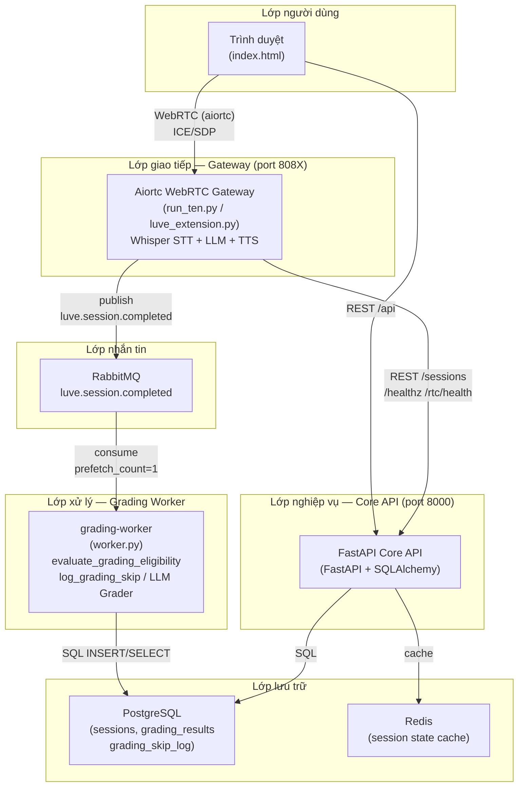
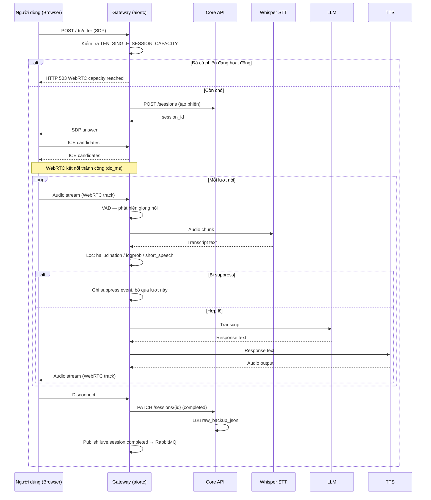
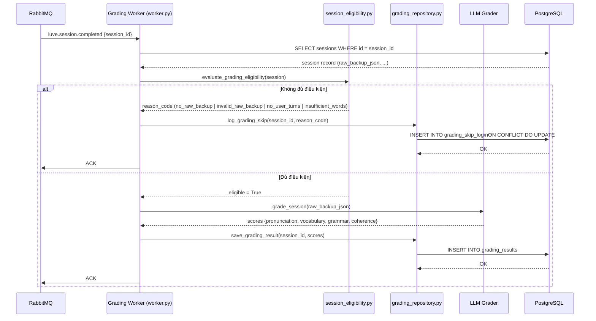
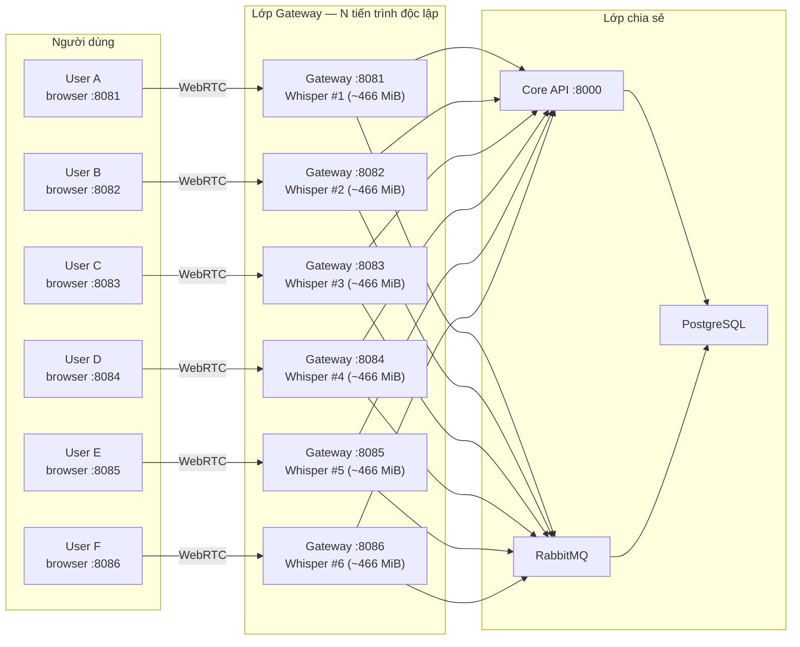

# Chương 3: Thiết Kế Hệ Thống

---

## 3.1 Tổng Quan Kiến Trúc Hệ Thống

### 3.1.1 Mục tiêu thiết kế

Hệ thống LUVE (*Language User Voice Evaluator*) được thiết kế để hỗ trợ người học luyện tập kỹ năng nói tiếng Anh thông qua các phiên hội thoại giọng nói thời gian thực với tác nhân AI. Các mục tiêu thiết kế cốt lõi bao gồm:

- **Tương tác thời gian thực**: Độ trễ đầu cuối đủ thấp để người dùng không nhận thấy gián đoạn trong hội thoại tự nhiên.
- **Đánh giá tự động**: Mỗi phiên nói được phân tích bất đồng bộ sau khi kết thúc, không ảnh hưởng đến trải nghiệm realtime.
- **Khả năng mở rộng đa người dùng**: Nhiều người dùng có thể luyện tập đồng thời mà không can thiệp lẫn nhau.
- **Tính bảo trì**: Kiến trúc phân lớp rõ ràng cho phép nâng cấp từng thành phần độc lập.

### 3.1.2 Tổng quan kiến trúc phân lớp

Hệ thống LUVE áp dụng kiến trúc phân lớp theo chiều dọc (*vertically layered architecture*) gồm bốn lớp chính:

| Lớp | Vai trò | Thành phần |
|-----|---------|-----------|
| **Lớp giao tiếp** | Tiếp nhận phiên WebRTC từ người dùng | Aiortc Gateway (port 808X) |
| **Lớp nghiệp vụ** | Xử lý logic phiên, xác thực, định tuyến | Core API (FastAPI, port 8000) |
| **Lớp nhắn tin** | Truyền sự kiện bất đồng bộ giữa dịch vụ | RabbitMQ (luve.session.completed) |
| **Lớp lưu trữ** | Lưu trạng thái phiên, kết quả chấm điểm | PostgreSQL, Redis |

Mô hình này phân tách rõ ràng giữa luồng realtime (lớp giao tiếp → lớp nghiệp vụ) và luồng chấm điểm bất đồng bộ (lớp nhắn tin → grading-worker), đảm bảo hiệu năng của luồng thời gian thực không bị ảnh hưởng bởi tác vụ tính toán nặng.

### 3.1.3 Sơ đồ kiến trúc tổng thể



---

## 3.2 Kiến Trúc Thành Phần

### 3.2.1 Aiortc WebRTC Gateway

Gateway là điểm tiếp xúc trực tiếp với người dùng. Thành phần này được xây dựng bằng thư viện **aiortc** — một triển khai WebRTC thuần Python — thay vì SDK TEN chính thức. Lý do lựa chọn aiortc là để kiểm soát toàn bộ vòng đời phiên trong môi trường Python đơn thuần, tránh phụ thuộc vào runtime ngoại vi.

**Cấu trúc module gateway:**

| Module | Chức năng |
|--------|-----------|
| `run_ten.py` | Entry point uvicorn; đăng ký router FastAPI |
| `luve_extension.py` | Điều phối phiên WebRTC: VAD → STT → LLM → TTS |
| `ten_compat.py` | Lớp tương thích giả lập interface TEN; định nghĩa `TEN_SINGLE_SESSION_CAPACITY = 1` (dòng 34) |
| `whisper_inference.py` | Singleton Whisper small.en (CUDA, int8_float16); lazy load lần đầu tiên nhận audio |
| `graph.json`, `manifest.json`, `property.json` | Cấu hình JSON tĩnh theo quy ước đặt tên TEN; không được thực thi bởi TEN runtime |

**Cơ chế giới hạn phiên:** `ten_compat.py:34` định nghĩa hằng số `TEN_SINGLE_SESSION_CAPACITY = 1`. Mỗi tiến trình gateway chỉ phục vụ tối đa một phiên WebRTC tại một thời điểm. Yêu cầu thứ hai trong khi phiên thứ nhất còn hoạt động sẽ nhận phản hồi HTTP 503 với thông báo `"WebRTC capacity reached"` (dòng 89–94).

**Lazy loading Whisper:** Mô hình Whisper small.en (~466 MiB VRAM) được tải vào GPU lần đầu khi có audio cần xử lý, không phải khi khởi động tiến trình. Điều này cho phép nhiều tiến trình gateway khởi động nhanh và chỉ chiếm VRAM khi thực sự hoạt động.

### 3.2.2 Core API

Core API là lớp nghiệp vụ trung tâm, đóng vai trò:
- Quản lý vòng đời phiên (tạo, cập nhật trạng thái, kết thúc).
- Lưu dữ liệu hội thoại thô (`raw_backup_json`) vào cơ sở dữ liệu.
- Cung cấp endpoint REST cho gateway và frontend.
- Phát hành sự kiện `luve.session.completed` lên RabbitMQ sau khi phiên hoàn thành.

Core API được triển khai bằng **FastAPI** và **SQLAlchemy**, chạy trên cổng 8000 và được chia sẻ bởi tất cả tiến trình gateway.

### 3.2.3 Grading Worker

Grading Worker là dịch vụ bất đồng bộ tiêu thụ hàng đợi RabbitMQ và thực hiện chấm điểm ngôn ngữ:

- **`worker.py`**: Vòng lặp tiêu thụ; `consume_forever()` chờ tin nhắn từ `luve.session.completed`.
- **`session_eligibility.py`**: Hàm `evaluate_grading_eligibility()` kiểm tra điều kiện chấm điểm theo 4 mã lý do.
- **`grading_repository.py`**: Lớp truy cập dữ liệu; `log_grading_skip()` ghi bản ghi bỏ qua vào `grading_skip_log` (idempotent qua `ON CONFLICT DO UPDATE`).
- **`llm_grader.py`**: Gọi LLM bên ngoài để chấm điểm phát âm, từ vựng, ngữ pháp, mạch lạc.

`prefetch_count=1` đảm bảo mỗi worker instance chỉ nhận một tin nhắn tại một thời điểm, cho phép mở rộng ngang bằng cách chạy nhiều worker song song.

### 3.2.4 Frontend

Frontend là một ứng dụng web tĩnh phục vụ từ Core API. Hàm `getDefaultGatewayUrl()` trong `index.html` tự động suy ra URL của gateway từ cổng hiện tại của trình duyệt, cho phép người dùng kết nối đúng gateway mà không cần cấu hình thủ công.

```
http://localhost:8081/control-center  →  gateway URL = http://localhost:8081
http://localhost:8082/control-center  →  gateway URL = http://localhost:8082
```

---

## 3.3 Luồng Realtime Speaking

### 3.3.1 Mô tả tổng quan

Luồng realtime xử lý một phiên hội thoại giọng nói từ khi người dùng kết nối đến khi phiên kết thúc. Luồng này được thiết kế để có độ trễ thấp nhất có thể trong giới hạn phần cứng phát triển.

**Các bước trong luồng:**

1. **Khởi tạo phiên**: Frontend gửi POST `/rtc/offer` với SDP offer. Gateway kiểm tra `TEN_SINGLE_SESSION_CAPACITY`; nếu đã có phiên thì trả 503.
2. **Tạo phiên trong DB**: Gateway gọi Core API để tạo bản ghi phiên mới với trạng thái `active`.
3. **ICE negotiation**: aiortc hoàn thành trao đổi ICE candidate với trình duyệt để thiết lập kênh WebRTC.
4. **VAD (Voice Activity Detection)**: Audio track từ WebRTC được đưa vào bộ phát hiện hoạt động giọng nói. Khi phát hiện lượt nói của người dùng, audio được ghi đệm.
5. **STT (Speech-to-Text)**: Đoạn audio được đưa vào Whisper small.en. Kết quả văn bản được kiểm tra bởi các bộ lọc: `probable_hallucination`, `low_average_logprob`, `short_speech` — nếu kích hoạt thì lượt nói bị *suppress* (bảo vệ chính xác, không phải lỗi).
6. **LLM response**: Văn bản hợp lệ được gửi đến mô hình ngôn ngữ (Groq API hoặc local) để sinh phản hồi hội thoại.
7. **TTS (Text-to-Speech)**: Phản hồi văn bản được chuyển thành âm thanh và phát lại cho người dùng qua WebRTC audio track.
8. **Lưu dữ liệu thô**: Toàn bộ lượt hội thoại (người dùng + AI) được lưu vào `raw_backup_json` trong bảng `sessions`.
9. **Kết thúc phiên**: Khi WebRTC peer disconnect, gateway cập nhật trạng thái phiên thành `completed` và phát hành sự kiện lên RabbitMQ.

### 3.3.2 Sơ đồ sequence luồng realtime



---

## 3.4 Luồng Chấm Điểm Bất Đồng Bộ

### 3.4.1 Thiết kế bất đồng bộ

Quyết định đặt chấm điểm ra ngoài luồng realtime xuất phát từ hai ràng buộc kỹ thuật:

1. **Tính toán LLM nặng**: Gọi LLM để đánh giá toàn bộ bài nói có thể mất hàng giây. Đặt trong luồng realtime sẽ làm tăng độ trễ của hội thoại.
2. **Độ ổn định**: Nếu chấm điểm thất bại (LLM timeout, mạng gián đoạn), phiên nói đã hoàn thành vẫn được bảo toàn nguyên vẹn.

RabbitMQ đóng vai trò trung gian durable: sự kiện `luve.session.completed` nằm trong hàng đợi bền vững cho đến khi worker xử lý thành công và gửi ACK.

### 3.4.2 Cổng kiểm tra điều kiện chấm điểm

Trước khi gọi LLM, hàm `evaluate_grading_eligibility()` trong `session_eligibility.py` kiểm tra bốn điều kiện. Nếu bất kỳ điều kiện nào không thỏa mãn, phiên được đánh dấu *bỏ qua* thay vì cố gắng chấm điểm trên dữ liệu thiếu hụt:

| Mã lý do | Điều kiện vi phạm |
|----------|------------------|
| `no_raw_backup` | `raw_backup_json` là `NULL` |
| `invalid_raw_backup` | `raw_backup_json` không phải mảng JSON hợp lệ |
| `no_user_turns` | Không có lượt nói nào của người dùng trong bản ghi |
| `insufficient_words` | Tổng số từ người dùng nói dưới ngưỡng tối thiểu |

Bản ghi bỏ qua được ghi vào bảng `grading_skip_log` qua `log_grading_skip()`, sử dụng `ON CONFLICT DO UPDATE` để đảm bảo idempotency — worker có thể xử lý lại cùng một tin nhắn mà không tạo bản ghi trùng lặp.

### 3.4.3 Sơ đồ sequence luồng chấm điểm



---

## 3.5 Thiết Kế Multi-User Scale-Out

### 3.5.1 Chiến lược mở rộng

Do ràng buộc `TEN_SINGLE_SESSION_CAPACITY = 1` — mỗi tiến trình gateway chỉ phục vụ một phiên WebRTC — hệ thống LUVE đạt được khả năng phục vụ nhiều người dùng đồng thời bằng cách chạy **N tiến trình gateway độc lập** trên **N cổng khác nhau**, thay vì thay đổi giới hạn trong một tiến trình duy nhất.

Cách tiếp cận này có các ưu điểm sau:
- **Cô lập lỗi**: Sự cố của gateway phục vụ User A không ảnh hưởng đến User B.
- **Cô lập VRAM**: Mỗi tiến trình có Whisper model riêng; không có tranh chấp lock cấp mô hình.
- **Không cần thay đổi mã**: Scale-out đạt được bằng cách chạy thêm tiến trình uvicorn, không cần sửa code.
- **Có thể thu hẹp dễ dàng**: Chỉ cần dừng các tiến trình không cần thiết.

### 3.5.2 Phân bổ VRAM

Mỗi tiến trình gateway tải một bản sao Whisper small.en (CUDA, int8_float16) tốn khoảng **466 MiB VRAM**. Trên máy phát triển RTX 3050 Ti (4096 MiB VRAM), ngân sách VRAM cho các kịch bản scale-out:

| Kịch bản | Số tiến trình | VRAM dự kiến | VRAM còn lại |
|----------|--------------|--------------|--------------|
| 2 người dùng | 2 | ~932 MiB | ~2840 MiB |
| 4 người dùng | 4 | ~1846 MiB | ~1925 MiB |
| 6 người dùng | 6 | ~2398 MiB | ~1373 MiB |
| 8 người dùng | 8 | ~2950 MiB (ước tính) | ~821 MiB (rủi ro) |

Kịch bản 8-user không được kiểm thử trong luận văn này vì mức VRAM còn lại (~821 MiB) đặt ra rủi ro CUDA OOM trong các đợt suy luận đồng thời. Phân tích chi tiết được trình bày trong Chương 4.

### 3.5.3 Sơ đồ scale-out multi-gateway



### 3.5.4 Định tuyến frontend

Hàm `getDefaultGatewayUrl()` trong `index.html` cho phép người dùng truy cập URL gateway của mình mà không cần cấu hình thủ công:

```
http://localhost:8081/control-center  →  gateway = http://localhost:8081
http://localhost:8082/control-center  →  gateway = http://localhost:8082
...
```

Frontend đọc `window.location.port` và ghép URL gateway tương ứng. Khi người dùng A mở cổng 8081 và người dùng B mở cổng 8082, mỗi người tự động kết nối đúng tiến trình gateway của mình.

---

## 3.6 Thiết Kế Dữ Liệu

### 3.6.1 Sơ đồ thực thể cốt lõi

Hệ thống duy trì ba nhóm bảng chính trong PostgreSQL:

**Nhóm phiên:**
- `sessions`: Bản ghi phiên với metadata (user_id, gateway_port, status, start_time, end_time) và `raw_backup_json` (mảng JSON toàn bộ lượt hội thoại).

**Nhóm chấm điểm:**
- `grading_results`: Kết quả chấm điểm thành công (pronunciation, vocabulary, grammar, coherence, overall, feedback_text).
- `grading_skip_log`: Bản ghi các phiên bị bỏ qua chấm điểm với lý do và nguồn gốc.

**Nhóm người dùng:**
- `users`: Thông tin tài khoản người dùng.

### 3.6.2 Thiết kế bảng grading_skip_log

Bảng `grading_skip_log` (thêm trong migration `d2bb908`) lưu vết kiểm toán cho mọi phiên không đủ điều kiện chấm điểm:

| Cột | Kiểu | Ràng buộc | Mô tả |
|-----|------|-----------|-------|
| `id` | `UUID` | `PRIMARY KEY DEFAULT gen_random_uuid()` | Khóa chính tự sinh |
| `session_id` | `UUID` | `NOT NULL UNIQUE REFERENCES sessions(id) ON DELETE CASCADE` | FK đến phiên; mỗi phiên chỉ có một bản ghi |
| `skipped_reason` | `TEXT` | `CHECK ('no_raw_backup' \| 'invalid_raw_backup' \| 'no_user_turns' \| 'insufficient_words')` | Mã lý do bỏ qua |
| `student_word_count` | `INT` | nullable | Số từ đếm được; chỉ điền khi `insufficient_words` |
| `min_words_threshold` | `INT` | nullable | Ngưỡng tối thiểu áp dụng tại thời điểm bỏ qua |
| `source` | `TEXT` | `DEFAULT 'worker' CHECK ('worker' \| 'scanner' \| 'backfill' \| 'manual')` | Thành phần tạo bản ghi |
| `skipped_at` | `TIMESTAMPTZ` | `NOT NULL DEFAULT CURRENT_TIMESTAMP` | Thời điểm ghi bỏ qua lần đầu |
| `updated_at` | `TIMESTAMPTZ` | `NOT NULL DEFAULT CURRENT_TIMESTAMP` | Thời điểm ON CONFLICT DO UPDATE gần nhất |

**Ràng buộc thiết kế quan trọng:**
- `UNIQUE (session_id)`: Mỗi phiên chỉ có tối đa một bản ghi bỏ qua; ON CONFLICT DO UPDATE cập nhật bản ghi hiện có thay vì tạo mới.
- `ON CONFLICT DO UPDATE`: Worker sử dụng upsert — xử lý lại tin nhắn RabbitMQ an toàn (idempotent).
- `CHECK` constraint trên `skipped_reason`: Toàn vẹn kiểu dữ liệu được ràng buộc ở lớp cơ sở dữ liệu.
- `source` cho phép phân biệt bản ghi tạo bởi worker thời gian thực, công cụ quét batch, backfill, hoặc thao tác thủ công.

### 3.6.3 Dữ liệu raw_backup_json

Trường `raw_backup_json` trong bảng `sessions` lưu toàn bộ bản ghi hội thoại dưới dạng mảng JSON. Mỗi phần tử đại diện cho một lượt:

```json
[
  {"role": "user", "content": "Hello, I want to practice speaking English."},
  {"role": "assistant", "content": "Great! Let's start with..."},
  ...
]
```

Hệ thống cố gắng lưu `raw_backup_json` dưới dạng mảng khi phiên hoàn thành. Tuy nhiên, grading worker vẫn kiểm tra điều kiện `no_raw_backup` (trường NULL) và `invalid_raw_backup` (không phải mảng JSON hợp lệ) để bảo vệ trước các trường hợp dữ liệu thiếu hụt. Khi hợp lệ, worker tiếp tục kiểm tra `no_user_turns` và `insufficient_words` trên nội dung mảng.

---

## 3.7 Tính Bảo Trì Và Mở Rộng

### 3.7.1 Phân tách quan tâm

Kiến trúc LUVE tuân theo nguyên tắc phân tách quan tâm (*separation of concerns*) ở nhiều cấp độ:

**Cấp dịch vụ:**
- Gateway chỉ xử lý WebRTC và suy luận AI; không biết về logic chấm điểm.
- Core API chỉ quản lý trạng thái phiên và định tuyến; không chứa logic AI.
- Grading worker chỉ tiêu thụ hàng đợi và gọi LLM; không giao tiếp với WebRTC.

**Cấp module trong Gateway:**
- `luve_extension.py` điều phối luồng; không chứa logic VAD/STT/LLM/TTS cụ thể.
- `ten_compat.py` cô lập các giả định về TEN interface khỏi phần còn lại của code.
- `whisper_inference.py` singleton pattern cho phép swap mô hình mà không ảnh hưởng đến extension.

### 3.7.2 Các điểm mở rộng được nhận diện

| Thành phần | Hướng mở rộng tiềm năng |
|-----------|------------------------|
| STT model | Thay Whisper small.en bằng model lớn hơn; chuyển sang API STT đám mây |
| LLM | Cấu hình Groq endpoint hoặc local model qua biến môi trường |
| Grading criteria | Thêm mã lý do mới vào `skipped_reason CHECK` và `evaluate_grading_eligibility()` |
| Scale-out | Thêm tiến trình gateway; thêm worker instance song song |
| Load balancer | Đặt Nginx/HAProxy trước các gateway để định tuyến tự động |
| Horizontal DB | Đọc replica PostgreSQL cho các query báo cáo |

### 3.7.3 Các ràng buộc thiết kế hiện tại

Thiết kế hiện tại phản ánh ràng buộc của môi trường phát triển đơn máy. Các giới hạn sau cần được giải quyết trong một triển khai thực tế:

- **Một GPU chia sẻ**: Tất cả tiến trình gateway cạnh tranh cùng một GPU RTX 3050 Ti. Môi trường production sẽ phân bổ GPU riêng hoặc dùng cloud GPU.
- **Định tuyến cổng thủ công**: Người dùng phải kết nối đúng cổng gateway của mình. Load balancer tự động sẽ ẩn điều này.
- **Chấm điểm một lượt**: Worker xử lý mỗi phiên một lần sau khi kết thúc; không hỗ trợ chấm điểm theo thời gian thực trong phiên.
- **Single host**: Tất cả dịch vụ chạy trên một máy. Kiến trúc phân tán đa máy chủ chưa được triển khai.

### 3.7.4 Ánh xạ yêu cầu đến thành phần

Bảng sau tóm tắt các yêu cầu hệ thống (R-01 đến R-10) và thành phần triển khai tương ứng:

| Yêu cầu | Mô tả | Thành phần triển khai |
|---------|-------|-----------------------|
| R-01 | WebRTC voice session | aiortc gateway, `luve_extension.py` |
| R-02 | VAD phát hiện giọng nói | VAD module trong `luve_extension.py` |
| R-03 | Chuyển đổi giọng → văn bản | `whisper_inference.py` (Whisper small.en) |
| R-04 | Sinh phản hồi AI | LLM call trong `luve_extension.py` |
| R-05 | Giới hạn 1 phiên/tiến trình | `ten_compat.py:34`, HTTP 503 |
| R-06 | Phiên đồng thời đa người dùng | N tiến trình uvicorn trên N cổng |
| R-07 | Chấm điểm bất đồng bộ | RabbitMQ + `worker.py` |
| R-08 | Kiểm tra điều kiện chấm điểm | `evaluate_grading_eligibility()` |
| R-09 | Ghi vết bỏ qua chấm điểm | `log_grading_skip()`, `grading_skip_log` |
| R-10 | Định tuyến frontend tự động | `getDefaultGatewayUrl()` trong `index.html` |

---

*Chương tiếp theo (Chương 4) trình bày kết quả kiểm thử thực nghiệm xác minh các thiết kế được mô tả trong chương này.*
